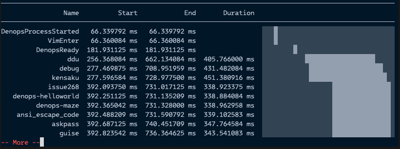
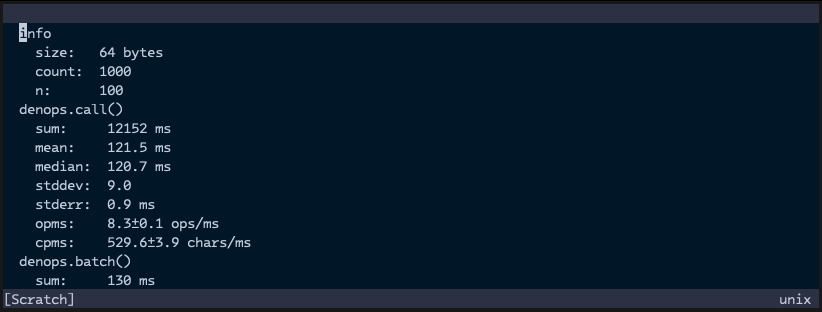

# FAQ

## How to Check Denops Startup Time

To check the startup time of Denops or Denops plugins, utilize
[denops-startup-recorder]. This plugin visualizes the timing of events related
to Denops and Denops plugin startup.

[denops-startup-recorder]: https://github.com/vim-denops/denops-startup-recorder.vim

It shows the result in echo area like:

## How to Check Denops Performance

To assess Denops performance, employ [denops-benchmark]. This plugin measures
the number of operations or characters that can be processed in milliseconds.

[denops-benchmark]: https://github.com/vim-denops/denops-benchmark.vim

It shows the result in a buffer like:

