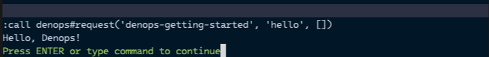

# Getting Started

[Denops] ([/ˈdiːnoʊps/](http://ipa-reader.xyz/?text=%CB%88di%CB%90no%CA%8Aps),
pronounced `dee-nops`) is an ecosystem for [Vim] / [Neovim] that empowers
developers to write plugins in [TypeScript] / [JavaScript] powered by [Deno].

Let's start by creating a simple plugin to learn how to develop Denops plugins.

## Create a Plugin

Create a directory named `denops-getting-started` in your home directory and a
file named `main.ts` within it, under `denops/denops-getting-started/`:

```
$HOME
└── denops-getting-started
    └── denops
        └── denops-getting-started
            └── main.ts
```

Next, write the following TypeScript code in `main.ts`:

```typescript
import type { Denops } from "https://deno.land/x/denops_std@v6.0.0/mod.ts";

export function main(denops: Denops): void {
  denops.dispatcher = {
    async hello() {
      await denops.cmd(`echo "Hello, Denops!"`);
    },
  };
}
```

## Activate the Plugin

Add the following line to your Vim or Neovim configuration file (e.g.,
`~/.vimrc` or `~/.config/nvim/init.vim`):

```vim
set runtimepath+=~/denops-getting-started
```

Or Neovim Lua configuration file (e.g., `~/.config/nvim/init.lua`):

```lua
vim.opt.runtimepath:append("~/denops-getting-started")
```

## Try the Plugin

Restart Vim/Neovim and execute the following command:

```vim
:call denops#request('denops-getting-started', 'hello', [])
```

You should see "Hello, Denops!" displayed on the screen like:



[Denops]: https://github.com/vim-denops/denops.vim
[Vim]: https://www.vim.org/
[Neovim]: https://neovim.io/
[TypeScript]: https://www.typescriptlang.org/
[JavaScript]: https://developer.mozilla.org/en-US/docs/Web/JavaScript
[Deno]: https://deno.land/
