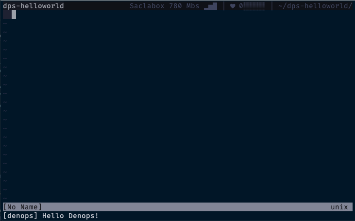

# Adding a Skelton of Denops Plugin

Once a Denops plugin is loaded, Denops calls the `main` function exported from
`main.ts` of the plugin code. So initially you can write `main.ts` like:

```ts:main.ts
import { Denops } from "https://deno.land/x/denops_std@v1.0.0/mod.ts";

export async function main(denops: Denops): Promise<void> {
  // Plugin program starts from here
  console.log("Hello Denops!");
};
```

An argument `denops` is passed to the `main` function, where `denops` is an
instance of `Denops` class exported from [denops-std][denops-std].

Then you restart vim, and you can see a message `[denops] Hello Denops!` on the
vim window.



[denops-std]: https://deno.land/x/denops_std

If you are too lazy to restart vim, you can simply run
`:call denops#server#restart()` on vim to reload Denops only.
