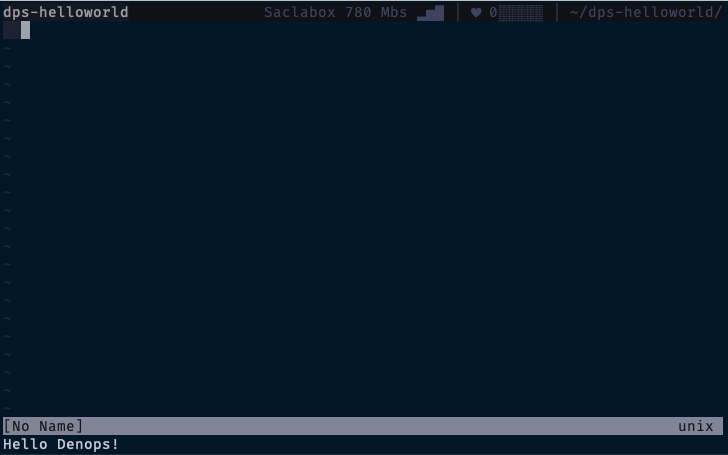

# Adding an API

Each Denops plugin registers one or more functions as APIs to Denops.
First, try to write an `echo()` function that returns a given string and register it as an API.
You can rewrite `main.ts` as follows:

```ts:main.ts
import { Denops } from "https://deno.land/x/denops_std@v1.0.0-beta.2/mod.ts";
import { ensureString } from "https://deno.land/x/unknownutil@v0.1.1/mod.ts";

export async function main(denops: Denops): Promise<void> {
  denops.dispatcher = {
    async echo(text: unknown): Promise<unknown> {
      // assure `text` is string type.
      ensureString(text);
      return await Promise.resolve(text);
    },
  };
};
```

Note that you can register a function that satisfies the following as an API:
- All of its arguments must be `unknown`.
- The type of return value must be either `Promise<unknown>` or `Promise<void>`.

Thus an `echo` API is registered to the `helloworld` plugin.
To call an API, you can use a vim command of the form `denops#request({plugin}, {func}, {args})`.
So you can use the `echo` API to execute the command below after restarting vim:

```vim
:echo denops#request('helloworld', 'echo', ["Hello Denops!"])
```

If it goes well, you will see `Hello Denops!`.



If a non-string argument is passed to the `echo` API, such as `denops#request('helloworld', 'echo', [123])`, Denops will raise an error:


