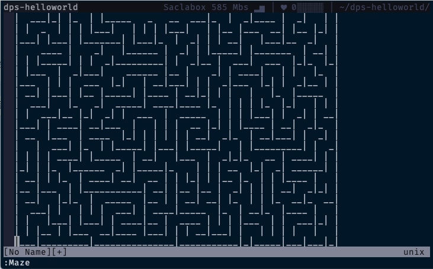
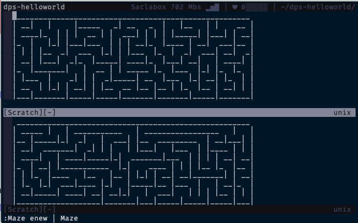

# Developing More Applicative Plugin

Now you have learned the basics of developing Denpos plugins in the previous
sections. Then it would be best if you tried to create a more functional plugin.

So let me ask you, out of the blue, have you ever itched to solve mazes while
programming? I never have. In any case, there may be people who love solving
mazes and can't get enough of it. So let's try to develop a Denops plugin that
can generate and display a maze in vim at any time.

Of course, it would be nice to start by coding a maze generation algorithm.
However, you are now with Deno so that you can use a third-party library
[maze_generator](https://deno.land/x/maze_generator@v0.4.0) for your
convenience. First, you should define a `Maze` command similarly to
`HelloWorldEcho`; `Maze` generates a maze and outputs it with `console.log()`.

```ts:main.ts
import { Denops } from "https://deno.land/x/denops_std@v1.0.0/mod.ts";
import { Maze } from "https://deno.land/x/maze_generator@v0.4.0/mod.js";

export async function main(denops: Denops): Promise<void> {
  denops.dispatcher = {
    async maze(): Promise<void> {
      const maze = new Maze({}).generate();
      const content = maze.getString();
      console.log(content);
    },
  };

  await denops.cmd(`command! Maze call denops#request('${denops.name}', 'maze', [])`);
};
```

Restarting vim, and you will see a maze by commands:

```vim
:Maze
:mes
```


Well done! But it is a little boring... So let's try to modify the code to make
a generated maze output to a buffer.

```ts:main.ts
import { Denops } from "https://deno.land/x/denops_std@v1.0.0/mod.ts";
import { Maze } from "https://deno.land/x/maze_generator@v0.4.0/mod.js";

export async function main(denops: Denops): Promise<void> {
  denops.dispatcher = {
    async maze(): Promise<void> {
      const maze = new Maze({}).generate();
      const content = maze.getString();
      await denops.cmd("enew");
      await denops.call("setline", 1, content.split(/\n/));
    },
  };

  await denops.cmd(`command! Maze call denops#request('${denops.name}', 'maze', [])`);
};
```

In this code, `denops.cmd()` executes the vim command `enew` to open a new
buffer in the current window and then `denops.call()` calls the vim function
`setline()` to write the maze to the buffer. Restart vim, rerun the commands,
and then you can see:



Awesome! Even if it looks like enough, you can improve your code a bit more.
Here is an example of a modification so that the `Maze` command can receive a
vim command other than `enew`, make a produced maze fit the current display
area, etc.:

```ts:main.ts
import { Denops } from "https://deno.land/x/denops_std@v1.0.0/mod.ts";
import { execute } from "https://deno.land/x/denops_std@v1.0.0/helper/mod.ts";
import { Maze } from "https://deno.land/x/maze_generator@v0.4.0/mod.js";
import { ensureString } from "https://deno.land/x/unknownutil@v0.1.1/mod.ts";

export async function main(denops: Denops): Promise<void> {
  denops.dispatcher = {
    async maze(opener: unknown): Promise<void> {
      ensureString(opener);
      const [xSize, ySize] = (await denops.eval("[&columns, &lines]")) as [
        number,
        number
      ];
      const maze = new Maze({
        xSize: xSize / 3,
        ySize: ySize / 3,
      }).generate();
      const content = maze.getString();
      await denops.cmd(opener || "new");
      await denops.call("setline", 1, content.split(/\r?\n/g));
      await execute(denops, `
        setlocal bufhidden=wipe buftype=nofile
        setlocal nobackup noswapfile
        setlocal nomodified nomodifiable
      `);
    },
  };

  await denops.cmd(`command! -nargs=? -bar Maze call denops#request('${denops.name}', 'maze', [<q-args>])`);
};
```

Now you can see a smaller maze shown on the window.


