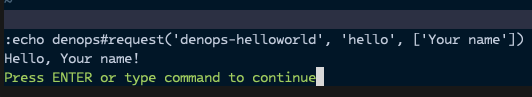

# Adding Denops API to the Plugin

In the previous section, we created a minimal Denops plugin. In this section, we
will enhance the plugin by adding an API.

Open `denops/denops-helloworld/main.ts` and rewrite the content with the
following code:

```typescript:denops/denops-helloworld/main.ts
import type { Denops } from "https://deno.land/x/denops_std@v6.0.0/mod.ts";
import { assert, is } from "https://deno.land/x/unknownutil@v3.14.1/mod.ts";

export function main(denops: Denops): void {
  denops.dispatcher = {
    hello(name) {
      assert(name, is.String);
      return `Hello, ${name || "Denops"}!`;
    },
  };
}
```

The above code adds a new API `hello` to the plugin. The `hello` API takes a
string `name` and returns a greeting message. See
[About User-Defined APIs in Explanation of the Getting started](../../getting-started/explanation.md#about-user-defined-apis)
for details about User-Defined APIs.

> [!NOTE]
>
> While Vim script does not facilitate types, Denops uses `unknown` types on the
> interface between Vim and Denops. That's why we use
> [unknownutil](https://deno.land/x/unknownutil) to ensure that the `name` is of
> type `string` in the above code.

Once you've updated the file, restart Vim, and execute the following command,
you will see the message "Hello, Your name!".

```
:echo denops#request("denops-helloworld", "hello", ["Your name"])
```

As shown, users can call the Denops API via the `denops#request()` function.


