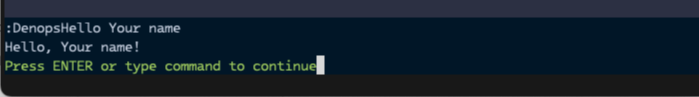

# Calling Vim Features from the Plugin

If you want to use a Vim feature from your Denops plugin, you can call it via
the `denops` instance passed to the plugin's `main` function. You can rewrite
`main.ts` as follows to register the `DenopsHello` as a Vim command:

```typescript,title=denops/denops-helloworld/main.ts
import type { Entrypoint } from "jsr:@denops/std@7.0.0";
import { assert, is } from "jsr:@core/unknownutil@3.18.1";

export const main: Entrypoint = (denops) => {
  denops.dispatcher = {
    async init() {
      // This is just an example.
      // Developers usually should define commands directly in Vim script.
      await denops.cmd(
        `command! -nargs=? DenopsHello echomsg denops#request('denops-helloworld', 'hello', [<q-args>])`,
      );
    },

    hello(name) {
      assert(name, is.String);
      return `Hello, ${name || "Denops"}!`;
    },
  };
};
```

Then, rewrite `plugin/denops-helloworld.vim` to automatically call the `init`
API on plugin load via the `DenopsPluginPost:{plugin_name}` autocmd:

```vim,title=plugin/denops-helloworld.vim
if exists('g:loaded_denops_helloworld')
  finish
endif
let g:loaded_denops_helloworld = 1

augroup denops_helloworld
  autocmd!
  autocmd User DenopsPluginPost:denops-helloworld
      \ call denops#notify('denops-helloworld', 'init', [])
augroup END
```

Once Vim is restarted, the `DenopsHello` command will be registered.

Then you can run:

```vim
:DenopsHello Your name
```

If the plugin has been registered successfully, you will see `Hello, Your name!`
as a result.



## Next Steps

In the next step, follow the tutorial to learn how to develop a real Denops
plugin.

- [Tutorial (Maze)](../tutorial/maze/README.md)
- [API reference](https://jsr.io/@denops/std)
