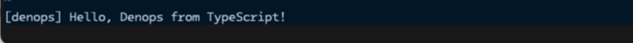

# Creating a Minimal Denops Plugin

When [denops.vim] is installed, it searches for files named `denops/*/main.ts`
in addition to Vim plugins when Vim starts.

If a corresponding file is found, Denops registers the parent directory name
(`foo` in the case of `denops/foo/main.ts`) as the plugin name. It then imports
the corresponding file as a TypeScript module and calls the function named
`main`.

> [!NOTE]
>
> Denops plugins typically include both TypeScript and Vim script code, so the
> directory structure looks like an extension of the Vim plugin structure with
> an added `denops` directory.

[denops.vim]: https://github.com/vim-denops/denops.vim

Let's add `denops/denops-helloworld/main.ts` to the `denops-helloworld`
directory that we created in the previous section. The directory tree will be as
follows:

```
denops-helloworld
├── denops
│    └── denops-helloworld
│           └── main.ts
└── plugin
     └── denops-helloworld.vim
```

Here is the content of the `denops/denops-helloworld/main.ts` file:

```typescript,title=denops/denops-helloworld/main.ts
import type { Entrypoint } from "jsr:@denops/std@^7.0.0";

export const main: Entrypoint = (denops) => {
  console.log("Hello, Denops from TypeScript!");
};
```

> [!WARNING]
>
> As shown above, developers can use `console.log` (or `console.warn`,
> `console.error`, etc.) for debug output. The content will be echoed to Vim.
> However, it is not recommended to use `console.log` in production code.
> Instead, use `denops.cmd("echo '...'")` or the `echo` function in the `helper`
> module of the `@denops/std` library.

Once you've created the file, restart Vim, and "Hello, Denops from TypeScript!"
will be displayed on Vim startup.


