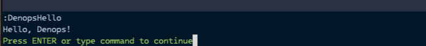

# Creating a Minimal Vim Plugin

Let's start by crafting a minimal Vim plugin called `denops-helloworld`.

Create a directory named `denops-helloworld` in your home directory and a Vim
script file as follows:

```
denops-helloworld
└── plugin
     └── denops-helloworld.vim
```

The content of the `plugin/denops-helloworld.vim` file is as follows:

```vim:plugin/denops-helloworld.vim
if exists('g:loaded_denops_helloworld')
  finish
endif
let g:loaded_denops_helloworld = 1

command! DenopsHello echo 'Hello, Denops!'
```

The initial four lines (as shown below) serve as a guard, preventing the plugin
from being loaded more than once. Using this guard is a common practice to
ensure the plugin is loaded only once.

```vim
if exists('g:loaded_denops_helloworld')
  finish
endif
let g:loaded_denops_helloworld = 1
```

The final line (as displayed below) defines a command named `DenopsHello` that
invokes the `echo 'Hello, Denops!'` command. Thus, when you execute
`:DenopsHello` in Vim, it will display "Hello, Denops!".

```vim
command! DenopsHello echo 'Hello, Denops!'
```

Upon startup, Vim searches and loads files named `plugin/*.vim` in directories
specified in `runtimepath`. To activate the plugin, add the following line to
your Vim configuration file (e.g., `~/.vimrc` or `~/.config/nvim/init.vim`):

```vim
set runtimepath+=~/denops-helloworld
```

For Neovim's Lua configuration file (e.g., `~/.config/nvim/init.lua`), use:

```lua
vim.opt.runtimepath:append("~/denops-helloworld")
```

Restart Vim and execute `:DenopsHello` to witness the message "Hello, Denops!".


