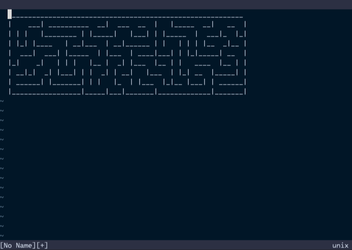

# Adjusting Maze Size to Fit the Window

In the previous section, we outputted the maze to a buffer. However, the maze
size can sometimes be too large or too small for the window. It would be better
to have a maze that fits the current window size.

Let's modify the plugin to ensure the generated maze fits the current window
size.

```typescript,title=denops/denops-maze/main.ts
import type { Entrypoint } from "@denops/std";
import * as fn from "@denops/std/function";
import { Maze } from "maze_generator";

export const main: Entrypoint = (denops) => {
  denops.dispatcher = {
    async maze() {
      await denops.cmd("enew");

      const winWidth = await fn.winwidth(denops, 0);
      const winHeight = await fn.winheight(denops, 0);
      const maze = new Maze({
        xSize: winWidth / 3,
        ySize: winHeight / 3,
      }).generate();
      const content = maze.getString();

      await fn.setline(denops, 1, content.split(/\r?\n/g));
    },
  };
};
```

In this code, we utilize the `function` module (aliased to `fn`) of
`@denops/std` (Denops Standard Library) to call `winwidth()`, `winheight()`, and
`setline()` functions. Then, we create a maze that fits the current window size
and write it to the buffer.

So why do we use the `function` module instead of `denops.call`? With
`denops.call`, developers must know the function name, arguments, return type,
and manually cast the return value to the expected type (like `as string`).
However, with the `function` module, developers can use auto-completion, type
checking, etc. It is more convenient and safe to use the `function` module.

> [!TIP]
>
> The `function` module of the `@denops/std` library provides a set of functions
> that are available on both Vim and Neovim. If you'd like to use Vim or Neovim
> only functions, use the `vim` or `nvim` module under the `function` module
> instead.
>
> See the
> [function module of @denops/std API document](https://jsr.io/@denops/std@7.0.0/doc/function/~)
> for more details.

Restart Vim, rerun the `:Maze` command, and then you can see:


