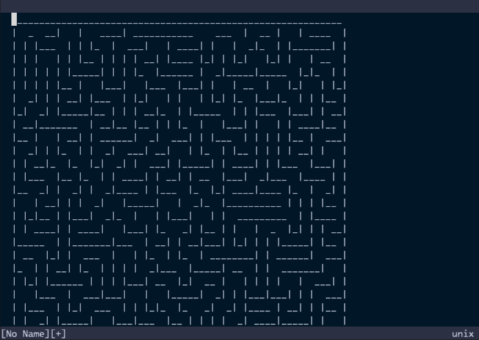

# Outputting Content to a Buffer

In the previous section, we echoed the maze to the echo area. However, echoing
the maze to the echo area is not very practical. In this section, we will output
the maze to a buffer so that users can yank the maze with daily Vim operations!

Let's modify the code to make the generated maze output to a buffer.

```ts:denops/denops-maze/main.ts
import type { Entrypoint } from "jsr:@denops/std@7.0.0";
import { Maze } from "npm:@thewizardbear/maze_generator@0.4.0";

export const main: Entrypoint = (denops) => {
  denops.dispatcher = {
    async maze() {
      const maze = new Maze({}).generate();
      const content = maze.getString();
      await denops.cmd("enew");
      await denops.call("setline", 1, content.split(/\r?\n/g));
    },
  };
};
```

In this code, `denops.cmd` executes the Vim command `enew` to open a new buffer
in the current window. Then, `denops.call` calls the Vim function `setline()` to
write the maze to the buffer.

Restart Vim, rerun the `Maze` command, and then you can see:


