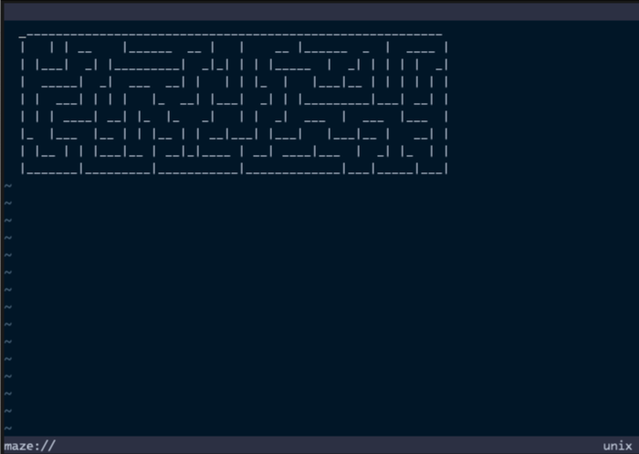

# Properly Create a Virtual Buffer

Now that the maze is displayed in a buffer, but it is not properly configured.
For example, if a user executes the `:edit` command on the buffer, the maze will
disappear. This is because Vim does not know how to reload the buffer content,
and we must inform Vim about the content of the buffer when it is reloaded.

In this section, we will use the `buffer` module of `@denops/std` to create a
proper virtual buffer that concretizes the buffer content. Let's modify the
`main.ts` file as follows:

```typescript:denops/denops-maze/main.ts
import type { Entrypoint } from "jsr:@denops/std@7.0.0";
import * as buffer from "jsr:@denops/std@7.0.0/buffer";
import * as fn from "jsr:@denops/std@7.0.0/function";
import { Maze } from "npm:@thewizardbear/maze_generator@0.4.0";

export const main: Entrypoint = (denops) => {
  denops.dispatcher = {
    async maze() {
      const { bufnr, winnr } = await buffer.open(denops, "maze://");

      const winWidth = await fn.winwidth(denops, winnr);
      const winHeight = await fn.winheight(denops, winnr);
      const maze = new Maze({
        xSize: winWidth / 3,
        ySize: winHeight / 3,
      }).generate();
      const content = maze.getString();

      await buffer.replace(denops, bufnr, content.split(/\r?\n/g));
      await buffer.concrete(denops, bufnr);
    },
  };
};
```

In this code, we use `buffer.open` to open a `maze://` buffer and get the buffer
number (`bufnr`) and the window number (`winnr`). Because Denops works
asynchronously, **the current buffer or window may be changed from what we
expected**. That's why developers should use `buffer.open` to open a buffer and
save the buffer number and the window number for further operations.

Then, we call `fn.winwidth` and `fn.winheight` with the obtained window number
to get the window size. Again, the current window might be changed, so we should
use `winnr` to specify the window.

> [!NOTE]
>
> Vim may execute some events between RPC calls, so the current buffer or window
> really may be changed from what we expected. Denops plugin developers should
> be careful about this. The best practice for avoiding this problem is to avoid
> using _current_ and always specify the buffer number or window number.

After that, we use `buffer.replace` to replace the content of the buffer.
Actually, replacing the buffer content is a bit tricky. Developers should care
about `modifiable` options to avoid unmodifiable errors, `foldmethod` options to
keep foldings, and should remove the buffer content that is not replaced by
`setline` or `setbufline`, etc. The `buffer.replace` function will care about
all of those, so developers should avoid using `setline` or `setbufline`
directly.

At the end, we call `buffer.concrete` to concretize the buffer content. This
function defines `BufReadCmd` autocmd to restore the content when the buffer is
reloaded. Without this, the buffer content will be discarded when the user
executes the `:edit` command.

Restart Vim, rerun the `:Maze` command, and then you can see:



Try the `:edit` command on the buffer, and you can see the maze is still there.
