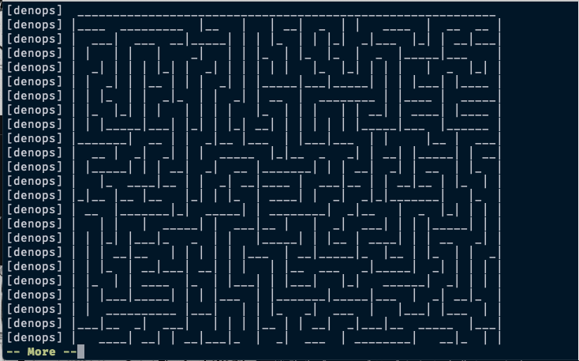

# Utilizing Third-Party Library

Certainly, starting with coding a maze generation algorithm would be nice.
However, since you're now using Deno, you can conveniently employ a third-party
library called [maze_generator](https://github.com/mjrlowe/maze_generator).
Let's define a `Maze` command similar to `DenopsHello`; `Maze` generates a maze
and outputs it.

> [!NOTE]
>
> The `maze_generator` library is a third-party library that generates a maze.
> It is not a part of Deno or Denops. You can use any third-party library that
> is compatible with Deno in your Denops plugin. Thanks to Deno, developers and
> users don't need to worry about the installation of third-party libraries.
> Deno automatically downloads and caches the library when it is imported.

Create the `denops-maze` plugin and place it under `~/denops-maze`. The
directory tree will look like this:

```
~/denops-maze
├── denops
│    └── denops-maze
│           └── main.ts
└── plugin
     └── denops-maze.vim
```

The content of the `denops/denops-maze/main.ts` file will be:

```typescript,title=denops/denops-maze/main.ts
import type { Entrypoint } from "jsr:@denops/std@^7.0.0";
import { Maze } from "npm:@thewizardbear/maze_generator@^0.4.0";

export const main: Entrypoint = (denops) => {
  denops.dispatcher = {
    maze() {
      const maze = new Maze({}).generate();
      const content = maze.getString();
      console.log(content);
    },
  };
};
```

The content of the `plugin/denops-maze.vim` file will be:

```vim,title=plugin/denops-maze.vim
if exists('g:loaded_denops_maze')
  finish
endif
let g:loaded_denops_maze = 1

" Function called once the plugin is loaded
function! s:init() abort
  command! Maze call denops#request('denops-maze', 'maze', [])
endfunction

augroup denops_maze
  autocmd!
  autocmd User DenopsPluginPost:denops-maze call s:init()
augroup END
```

> [!TIP]
>
> The `Maze` command is defined once the plugin is loaded with the above code.
> If you wish to define the command immediately after Vim startup, you can
> define the command and use `denops#plugin#wait()` or
> `denops#plugin#wait_async()` in the function to wait for plugin load, like
> this:
>
> ```vim,title=plugin/denops-maze.vim
> if exists('g:loaded_denops_maze')
>   finish
> endif
> let g:loaded_denops_maze = 1
>
> function! s:maze() abort
>   if denops#plugin#wait('denops-maze')
>      " Something went wrong
>      return
>   endif
>   call denops#request('denops-maze', 'maze', [])
> endfunction
>
> command! Maze call s:maze()
> ```

Don't forget to activate the plugin by adding the following line to your
`vimrc`:

```vim
set runtimepath+=~/denops-maze
```

Then, restart Vim and execute `:Maze` to see the generated maze. Note that it
may take a few seconds for the first startup because Deno will download the
dependencies, but it happens only once.


